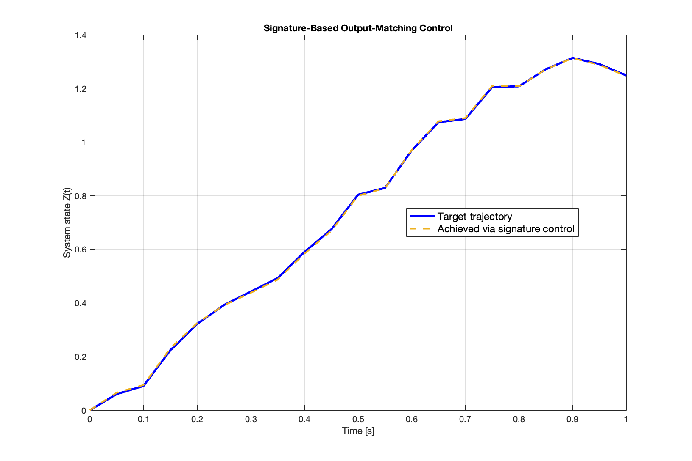

# Signature-Based Output-Matching Control

This repository contains MATLAB code for reproducing the numerical experiment in Section 5.2 of the paper:

> *"On the role of the signature transform in nonlinear systems and data-driven control"*

The experiment demonstrates how to:
1. Train a signature-based model of nonlinear system dynamics.
2. Solve an output-matching control problem via nonlinear optimization.
3. Analyze and visualize the results.

## 📁 File Structure
- `run_experiment.m` – Main script to run the full pipeline.
- `simulate_system.m` – Euler integrator for the nonlinear system.
- `generate_indices.m` – Generates multi-indices for truncated signatures.
- `build_signature_matrix.m` – Constructs pathwise signature features.
- `optimization_objective.m` – Cost function for `fmincon`.

## ▶️ How to Run
Ensure all `.m` files are in the same directory, then run:

```matlab
run_experiment

